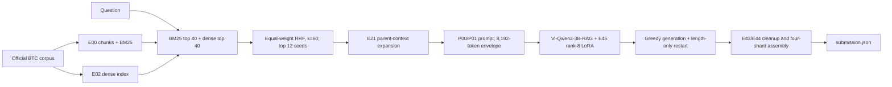

# E45 — Vietnamese Legal Question Answering (UIT DSC 2026 Task 2)

The team's submitted system retrieves passages from the competition's official legal corpus, expands selected evidence to parent context, and generates Vietnamese answers with a rank-8 LoRA adapter on Vi-Qwen2-3B-RAG. This repository records the **system actually submitted**, its engineering decisions, and a source-only reproduction path. Competition data, private questions and answers, model weights, indexes, checkpoints and submission files are deliberately absent.

| Private-test metric | Reported score |
|---|---:|
| METEOR (primary) | **0.597327402** |
| ROUGE-L | **0.586192885** |

These values are from the team's Codabench `scores.json`. The submitted ZIP SHA-256 is `d697c48e4ce48410ad4695291c98891f9f872a88cf0f6d1dfc576d8dbf86496b`; its 1,918 answers passed local schema and coverage checks. A durable Codabench result export tying the score to that submission remains to be added. We make no rank or award claim.



The E45 adapter was trained on **5,636 official training records** for **705 optimizer steps**. It aligns training inputs with the parent-context evidence and prompt used at inference. The frozen configuration inventories **3,668,660,224** parameters across the model stack, below the competition's strict 4-billion-parameter ceiling. See [architecture](docs/architecture.md), [experiment decisions](docs/experiment-ledger.md), and [competition rules](docs/competition-rules.md).

## What was submitted

Four Kaggle shards generated 1,918 private-test answers. Under the submission deadline, 143 rows whose length-only 1,536-token restart was unfinished used their saved 1,024-token first-pass answer. This is a documented deviation from the intended complete restart policy; the score above belongs to **this exact fallback run**. See [submitted run](docs/submitted-run.md) and [limitations](docs/limitations.md).

## Repository map

| Path | Contents |
|---|---|
| `src/uit_dsc_fixed_rag/` | Frozen E00/E02 retrieval, E21/E44 context, E45 preparation/training/generation, and experiment implementations |
| `src/e45_private_*.py` | Four-shard scheduling, checkpointing and generation |
| `scripts/` | Training, generation, admission and emergency merge entry points |
| `notebooks/` | Final Account A packaging notebook and four resumable private shard notebooks |
| `configs/` | Frozen E45 configuration |
| `tests/` | CPU/static integrity and behavior tests from the implementation |
| `docs/` | Architecture, rules, decisions, provenance and reproduction guide |

Historical experiment modules are included for research traceability; they are not all components of the submitted runtime. This repository is a curated code snapshot, not the multi-milestone development monorepo.

## Reproduce with authorized inputs

Use the official BTC data obtained through the competition, the exact model revisions in the config, and the externally held E00/E02 indexes and E45 adapter identified in [artifact hashes](docs/artifact-hashes.md). Never commit these assets. The [reproducibility guide](docs/reproducibility.md) identifies the actual notebook and scripts, runtime requirements, validation boundaries and the deadline fallback. CPU/static checks can be run without private data:

```bash
python -m compileall -q src scripts
python -m pytest -q tests/test_e45_static_prepare_jsonl.py tests/test_private_checkpoint_resume.py
```

The full Kaggle run requires GPUs, official inputs and the missing weight/index artifacts. The private leaderboard score cannot be reproduced from this source-only repository alone.

## Competition and publication boundaries

The method uses official competition data only, no synthetic QA or external legal corpus, no model API, and a total model parameter count below 4B. METEOR is the primary official metric; ROUGE-L is secondary. The actual Codabench submission format is a ZIP containing only UTF-8 `submission.json`, an object mapping each question ID to `{"answer": "..."}`. The [rules note](docs/competition-rules.md) distinguishes the team's recorded competition contract from organizer source documents. No official data or generated private answers are published here.

Model and team credits appear in [attribution](docs/attribution.md). The source code is published for inspection; redistribution rights for the adapter and official data are separate questions. No open-source license is claimed until team ownership and upstream obligations are confirmed.
