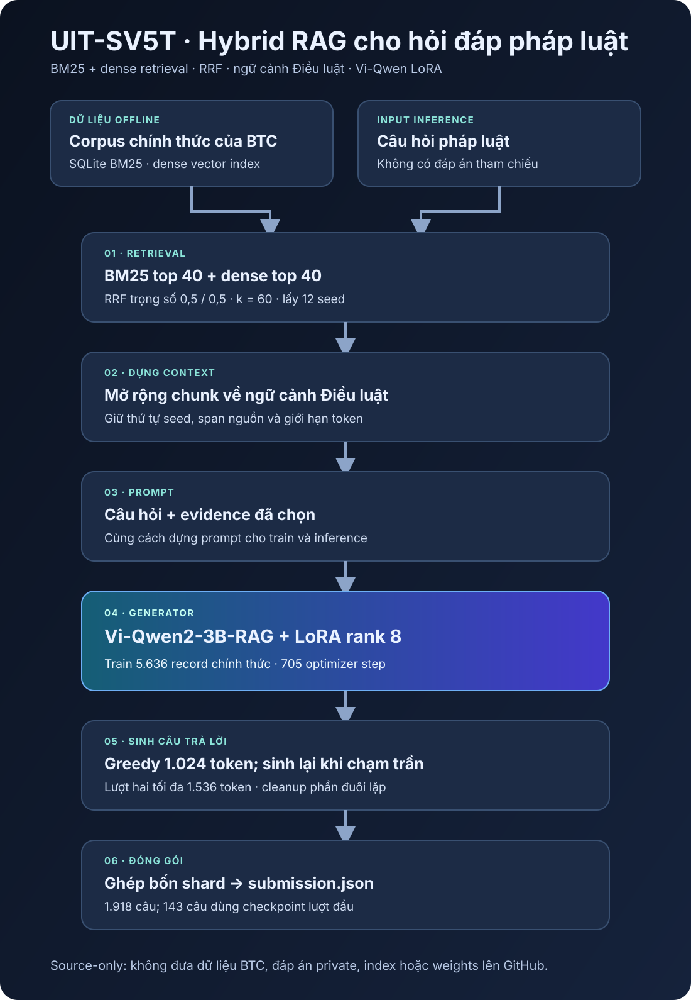

# UIT-SV5T · Hỏi đáp pháp luật tiếng Việt bằng Hybrid RAG

Đây là source của hệ thống UIT-SV5T dùng cho Task 2, UIT Data Science Challenge 2026. Hệ thống tìm căn cứ trong corpus chính thức bằng **BM25 và dense retrieval**, gộp kết quả bằng **Reciprocal Rank Fusion (RRF)**, mở rộng đoạn tìm được về ngữ cảnh Điều luật, rồi dùng **Vi-Qwen2-3B-RAG fine-tune bằng LoRA** để viết câu trả lời.

<p align="center">
  
</p>

## Kết quả private test

| Metric | Điểm |
|---|---:|
| **METEOR** — metric chính | **0.597327402** |
| **ROUGE-L** | **0.586192885** |

Đây là hai giá trị trong `scores.json` đội nhận từ Codabench. File `submission.zip` đã nộp có SHA-256 `d697c48e4ce48410ad4695291c98891f9f872a88cf0f6d1dfc576d8dbf86496b`. Bản ZIP chứa 1.918 câu trả lời và đã qua kiểm tra format, số lượng ID ở local. Repo chưa có bản export Codabench lưu lâu dài để đối chiếu độc lập điểm với lần nộp này. Chúng tôi không công bố thứ hạng hoặc giải thưởng khi chưa có bằng chứng tương ứng.

## Hệ thống hoạt động thế nào?

1. **Chuẩn bị corpus:** Từ dữ liệu của Ban tổ chức, hệ thống tạo các chunk có thể truy ngược về văn bản nguồn, một BM25 index trong SQLite và một dense vector index. Dense encoder là `AITeamVN/Vietnamese_Embedding`.
2. **Tìm căn cứ:** Mỗi câu hỏi lấy 40 candidate từ BM25 và 40 từ dense retrieval. RRF gộp thứ hạng hai nhánh với trọng số ngang nhau, lấy 20 kết quả đầu và chọn 12 seed context. Bản nộp này không dùng cross-encoder reranker.
3. **Dựng ngữ cảnh:** Từ các seed, hệ thống mở rộng về Điều luật và các đoạn lân cận theo giới hạn token; giữ thứ tự, vị trí trong văn bản gốc và các điều kiện fallback. Cùng một cách dựng context và prompt được dùng khi fine-tune lẫn inference.
4. **Sinh câu trả lời:** `AITeamVN/Vi-Qwen2-3B-RAG` dùng LoRA rank 8. Generation theo greedy decoding; câu chạm trần 1.024 token được sinh lại từ input IDs gốc với trần 1.536 token. Cleanup chỉ xử lý phần đuôi lặp theo quy tắc đã chốt.
5. **Đóng gói:** Private test được chia thành bốn shard chạy độc lập trên Kaggle. Mỗi câu hoàn thành được lưu vào checkpoint; kết quả được ghép thành `submission.json` đúng format Codabench.

LoRA được train trên **5.636 record chính thức** trong **705 optimizer step**, với `assistant-only loss` và giới hạn **8.192 token** cho toàn bộ sequence. Inventory đã chốt ghi nhận tổng **3.668.660.224 tham số** cho các model trong hệ thống, dưới ngưỡng *nhỏ hơn 4 tỷ* của cuộc thi. [Kiến trúc chi tiết](docs/architecture.md) giải thích ranh giới offline, train và inference; [nhật ký quyết định](docs/experiment-ledger.md) ghi lại lý do chọn từng kỹ thuật và giới hạn của các phép so sánh.

## Bản nộp thực tế có một ngoại lệ

Bốn shard tạo đủ 1.918 câu trả lời. Khi đến deadline, **143 lượt sinh lại chưa xong**. Bản nộp dùng câu trả lời lượt đầu đã lưu trong checkpoint cho 143 trường hợp đó; các lượt sinh lại đã hoàn tất vẫn được giữ nguyên. Điểm private ở trên thuộc **đúng bản nộp này**, không phải một lần chạy mà mọi lượt sinh lại đều hoàn tất. Xem [báo cáo bản nộp](docs/submitted-run.md) và [giới hạn của kết quả](docs/limitations.md).

## Trong repo có gì?

| Thư mục | Nội dung |
|---|---|
| `src/` | Retrieval, dựng context, chuẩn bị dữ liệu train, train, inference và checkpoint; có cả module của các thử nghiệm trước |
| `scripts/` | Entry point để chuẩn bị, train, chạy private và ghép bản nộp |
| `notebooks/` | Notebook train trên hai T4 và bốn notebook private có checkpoint |
| `configs/` | Cấu hình đã đóng băng cho lần chạy cuối |
| `tests/` | Test CPU/static cho format, hash, checkpoint và các hợp đồng hành vi |
| `docs/` | Kiến trúc, nội quy cuộc thi, quyết định kỹ thuật, hash artifact và cách tái lập |

Tên file trong code vẫn giữ mã thí nghiệm nội bộ để đối chiếu chính xác với config, checkpoint và lần chạy đã nộp. Các mã đó **không phải tên công nghệ**. Trang [nhật ký quyết định](docs/experiment-ledger.md) chỉ ra vai trò thực tế của từng phần. Repo đã được tuyển chọn từ quá trình phát triển, không phải bản copy toàn bộ workspace.

## Chạy kiểm tra source

Không cần dữ liệu private để chạy test:

```bash
python -m compileall -q src scripts
python -m pytest -q tests
```

Muốn chạy lại pipeline đầy đủ cần dữ liệu chính thức, model đúng revision, các index và LoRA adapter đã train. Các file đó **không có trong Git**. [Hướng dẫn tái lập](docs/reproducibility.md) ghi rõ notebook đã dùng, runtime cần khớp và cách kiểm tra artifact. [Danh sách SHA-256](docs/artifact-hashes.md) giúp nhận diện đúng đầu vào mà không phát tán dữ liệu.

## Ranh giới công bố

Repo không chứa dữ liệu train/public/private của BTC, câu trả lời private, `submission.zip`, index, checkpoint hay trọng số model. Hệ thống chỉ dùng dữ liệu chính thức; không dùng synthetic QA, corpus pháp luật ngoài cuộc thi hoặc model API. Format Codabench đã dùng là ZIP chỉ chứa một file `submission.json` UTF-8, với mỗi ID ánh xạ tới `{"answer": "..."}`. [Nội quy và hợp đồng chấm điểm](docs/competition-rules.md) ghi lại nguồn đã kiểm tra và cách hệ thống áp dụng.

[Ghi nhận nguồn và quyền sử dụng](docs/attribution.md) phân biệt source của đội với model, dữ liệu và scorer từ bên ngoài. Repo chưa gắn giấy phép open-source cho code khi quyền của các thành viên và nghĩa vụ với upstream chưa được xác nhận.
